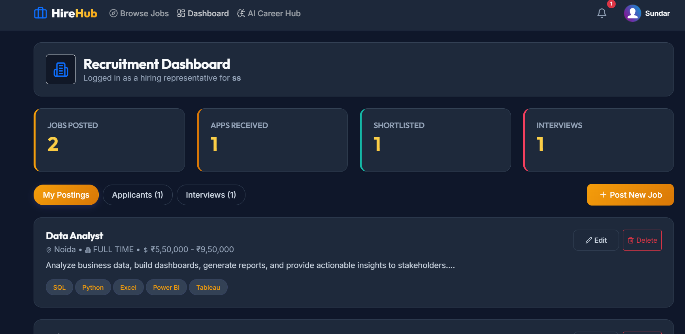

# 💼 HireHub – AI-Powered Job Portal & Career Platform

[](https://hirehub-jobportal96.netlify.app)
[](https://github.com/swapnilbharate/Hirehub)
[](#-tech-stack)

**HireHub** is an end-to-end full-stack career platform built with **Spring Boot**, **React.js**, and **Gemini AI**. It connects job seekers with recruiters while providing AI-driven tools like **Resume Analysis**, **AI Mock Interviews**, and **Smart Job Recommendations**.

---

## 📸 Preview & Interface



---

## ✨ Key Features

### 👨‍💻 For Job Seekers (Candidates)
- **AI Resume Analyzer**: Instant scoring and feedback on resumes powered by Gemini AI.
- **AI Mock Interviewer**: Interactive AI-driven technical interview practice sessions.
- **Smart Job Search & Filters**: Search jobs by role, location, salary range, and tech stack.
- **One-Click Application & Tracker**: Apply to jobs and track application progress (Pending, Reviewed, Accepted).
- **Saved Jobs & Library**: Bookmark jobs for quick access.

### 🏢 For Recruiters (Employers)
- **Job Posting & Management**: Post new job openings with dynamic requirements and tags.
- **Applicant Tracking System (ATS)**: Filter candidates, review resumes, and manage applicant status.
- **Recruiter Analytics Dashboard**: Track total job postings, applicants count, and hiring pipeline.

### 🔐 Security & Architecture
- **Role-Based Access Control (RBAC)**: Secure authorization for Candidates and Recruiters.
- **JWT & Spring Security**: Secure token authentication and API endpoint protection.
- **PostgreSQL Database**: Scalable relational data storage for user accounts, jobs, and applications.

---

## 🛠️ Tech Stack

### **Backend**
- **Framework**: Java 17, Spring Boot 3
- **Security**: Spring Security, JWT (JSON Web Tokens)
- **Database / ORM**: PostgreSQL, Spring Data JPA, Hibernate
- **AI Service**: Google Gemini AI API integration
- **Build Tool**: Maven

### **Frontend**
- **Library**: React.js (Vite)
- **State & Routing**: React Router DOM, Context API
- **HTTP Client**: Axios
- **Styling**: Modern CSS3, Responsive Design, Glassmorphism UI

---

## 🚀 Getting Started Locally

### Prerequisites
- Java JDK 17+
- Node.js (v18+) & npm
- PostgreSQL database

### 1️⃣ Clone Repository
```bash
git clone https://github.com/swapnilbharate/Hirehub.git
cd Hirehub
```

### 2️⃣ Backend Setup (Spring Boot)
1. Configure your database settings in `backend/src/main/resources/application.properties`:
   ```properties
   spring.datasource.url=jdbc:postgresql://localhost:5432/hirehub_db
   spring.datasource.username=postgres
   spring.datasource.password=YOUR_PASSWORD
   gemini.api.key=YOUR_GEMINI_API_KEY
   ```
2. Build and run backend server:
   ```bash
   cd backend
   mvn spring-boot:run
   ```

### 3️⃣ Frontend Setup (React.js)
```bash
cd frontend
npm install
npm run dev
```

---

## 🌐 Live Application
- **Frontend Live URL**: [https://hirehub-jobportal96.netlify.app](https://hirehub-jobportal96.netlify.app)
- **GitHub Repository**: [https://github.com/swapnilbharate/Hirehub](https://github.com/swapnilbharate/Hirehub)

---

## 👨‍💻 Author
**Swapnil Bharate**  
- **Role**: Java Full Stack Developer  
- **GitHub**: [@swapnilbharate](https://github.com/swapnilbharate)  
- **LinkedIn**: [Swapnil Bharate](http://www.linkedin.com/in/swapnil-bharate-b84408291)
